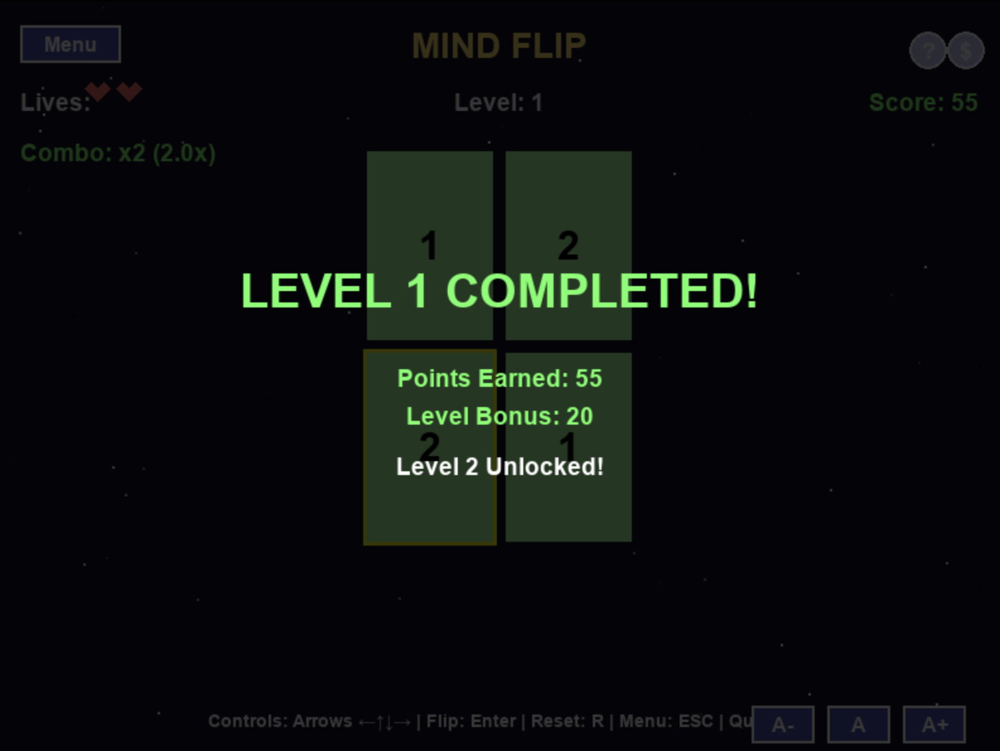

# AWS Arcade

A collection of arcade-style games built with Python, demonstrating AWS CLI integration for various features.

## Games

### MindFlip: Memory Arcade


A captivating memory card matching game with dynamic difficulty progression and engaging gameplay features. Test your memory skills as you navigate through increasingly challenging levels!

#### Key Features:

- **Progressive Difficulty**: Start with a simple 2x2 grid and advance to larger grids with more cards
- **Combo System**: Chain successful matches to earn bonus points with multipliers up to 3x
- **Accessibility Options**: Adjustable text sizes for better readability
- **Dynamic Card Scaling**: Cards automatically resize to fit different grid sizes
- **Animated Background**: Engaging starfield animation creates an immersive experience
- **High Score Tracking**: Local high score persistence between game sessions
- **Lives System**: Strategic gameplay with limited lives that increase as you progress
- **Debug Mode**: Special mode for testing and development

[Play MindFlip](./mindflip/README.md)

#### Screenshots:

<div align="center">
  
  
</div>

<div align="center">
  
  
</div>

## Setup

### Prerequisites
- Python 3.8+
- Pygame library

### Installation

1. Clone the repository:
```bash
git clone https://github.com/ankitkumar423/aws-arcade.git
cd aws-arcade
```

2. Install dependencies:
```bash
pip install -r requirements.txt
```

3. Run a game:
```bash
python -m mindflip
```

Each game has additional setup instructions in its respective directory.

## Controls

### MindFlip
- **Arrow Keys**: Navigate the card grid
- **Enter**: Flip selected card
- **R**: Restart game
- **ESC**: Return to main menu
- **Q**: Quit game
- **A-, A, A+**: Adjust text size

## AWS Integration

Future versions will demonstrate AWS CLI integration for features like:
- Storing high scores in DynamoDB
- User authentication with Cognito
- Leaderboards with API Gateway and Lambda
- Game asset storage in S3
- Multiplayer capabilities with WebSockets

## Development Roadmap

- [x] Basic memory card game mechanics
- [x] Progressive difficulty system
- [x] Combo scoring system
- [x] Adjustable text size for accessibility
- [ ] Power-up cards with special abilities
- [ ] Sound effects and background music
- [ ] AWS integration for online features
- [ ] Additional themes and card designs
- [ ] Mobile-friendly controls

## Contributing

Feel free to contribute new games or improvements to existing ones by submitting a pull request.

1. Fork the repository
2. Create your feature branch (`git checkout -b feature/amazing-feature`)
3. Commit your changes (`git commit -m 'Add some amazing feature'`)
4. Push to the branch (`git push origin feature/amazing-feature`)
5. Open a Pull Request

## License

This project is licensed under the MIT License - see the LICENSE file for details.
