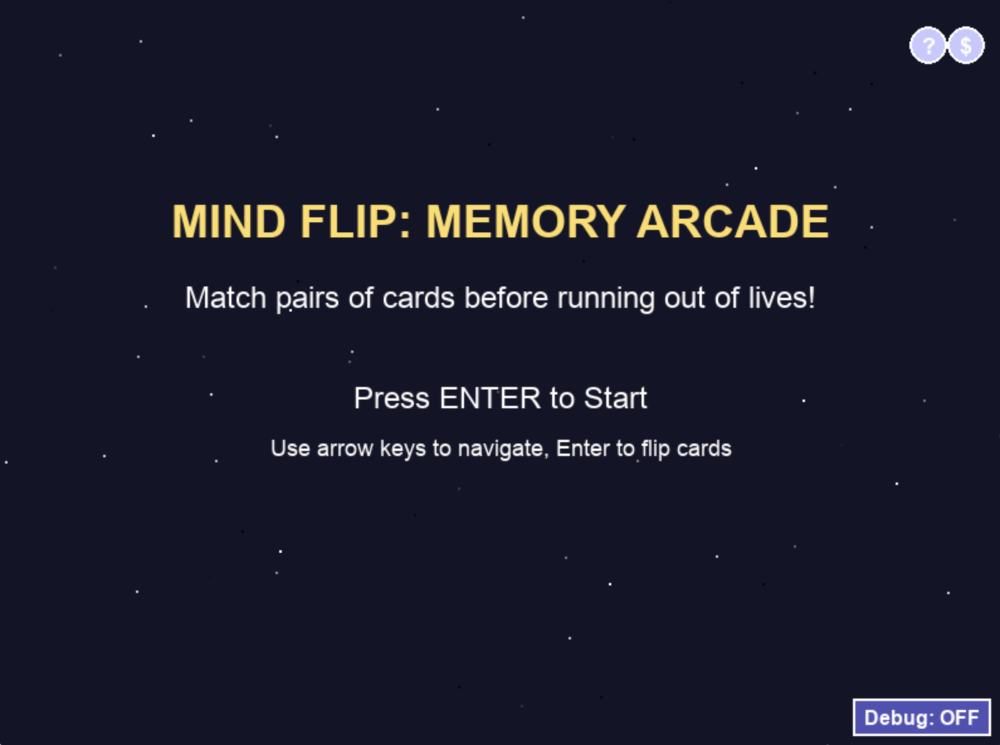
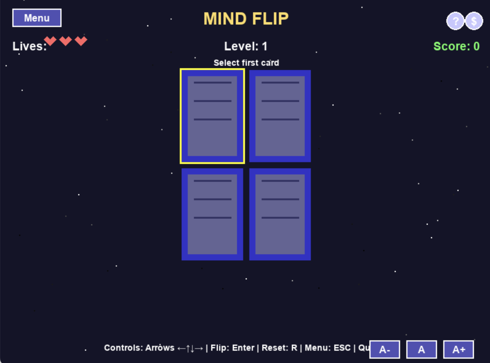
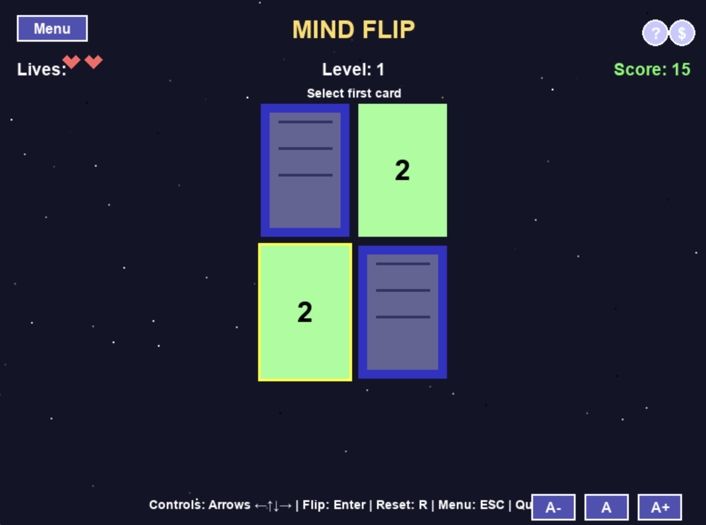
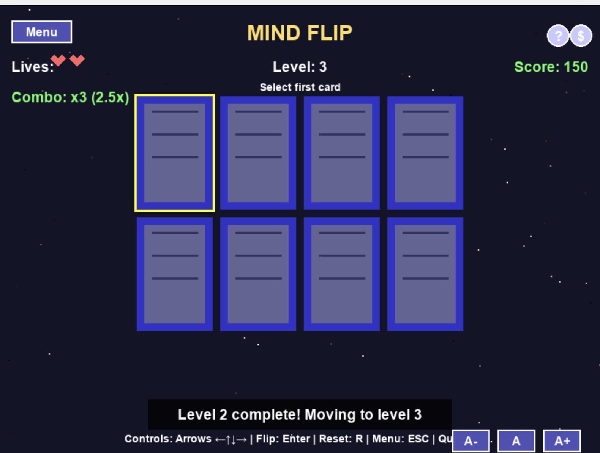
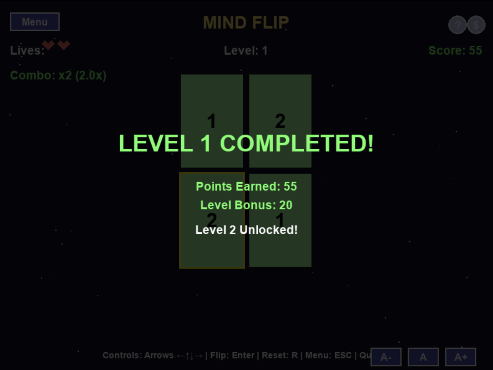

# MindFlip: Memory Arcade



## Overview

MindFlip is a captivating memory card matching game that challenges your recall abilities while providing an engaging and progressively difficult experience. The game features a clean, accessible interface with multiple accessibility options and gameplay enhancements.

## Gameplay

The objective is simple: find matching pairs of cards by flipping them over two at a time. But don't be fooled by the simplicity - as you progress through levels, the grid size increases, presenting a greater challenge with more cards to match.

### Key Features

#### Progressive Difficulty System
- Start with a simple 2x2 grid (4 cards, 2 pairs)
- Each level adds one additional pair of cards
- Grid sizes automatically adjust: 2x2 → 2x3 → 2x4 → 3x4 → 4x4 → 4x5 → 4x6
- Maximum of 24 cards (12 pairs) ensures the game remains playable on standard screens

#### Strategic Combo System
- Chain successful matches to build a combo multiplier
- Each consecutive match increases your score multiplier (up to 3x)
- Combo resets if you miss a match or take too long between matches
- Visual indicator shows your current combo count and multiplier

#### Accessibility Features
- Three text size options for better readability
- Dynamic card scaling to fit different grid sizes
- High contrast colors for better visibility
- Clear visual feedback for game state changes

#### Engaging Visual Elements
- Animated starfield background creates an immersive atmosphere
- Smooth transitions between game states
- Toast notifications provide clear feedback on actions
- Highlight system shows the currently selected card

#### Game Progression
- Lives system adds strategic depth
- Earn extra lives every two levels
- High score tracking between sessions
- Level completion bonuses reward progress

## Screenshots

<div align="center">
  
  
</div>

<div align="center">
  
  
</div>

<div align="center">
  
  
</div>

## Controls

- **Arrow Keys**: Navigate the card grid
- **Enter**: Flip selected card
- **R**: Restart game
- **ESC**: Return to main menu
- **Q**: Quit game
- **A-, A, A+**: Adjust text size (small, medium, large)
- **D**: Toggle debug mode (shows card values)

## Scoring System

- **Match Found**: +10 points (base)
- **Combo Bonus**: Up to 3x multiplier for consecutive matches
- **Level Completion**: +20 points × current level
- **Extra Life**: Awarded every 2 levels

## Technical Details

### Architecture
- **Card Class**: Represents individual cards with state management
- **Game Class**: Handles game logic, scoring, and level progression
- **UI Class**: Manages rendering and user interface elements
- **Main Module**: Controls game loop and event handling

### Implementation Details
- Built with Python and Pygame
- Responsive design adapts to different grid sizes
- Modular code structure for easy expansion
- Local file storage for high scores

## Future Enhancements

- Power-up cards with special abilities
- Sound effects and background music
- Online leaderboards via AWS integration
- Additional card themes and designs
- Customizable difficulty settings

## Running the Game

```bash
# From the aws-arcade directory
python -m mindflip
```

Enjoy the game and challenge yourself to reach higher levels!
